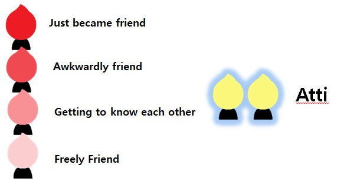
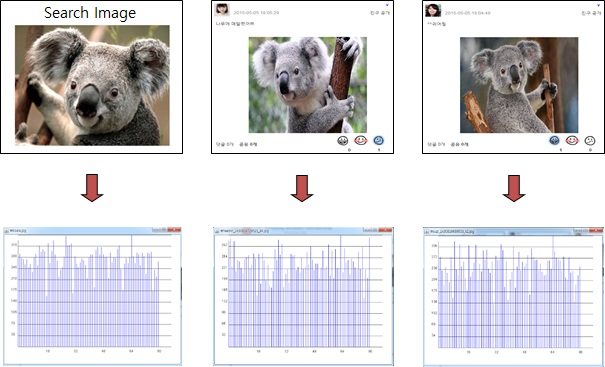

# SNS_Bukku
 The privacy-oriented SNS

This project has been in progress for a month since January 2015.

In addition to basic SNS functions, there are two differentiating functions for the purpose of privacy protection.

Detail Video: https://blog.naver.com/wltmdgk/22035399774

### 1.'Just Like'

Likes you marked are not visible to others. It is a function that displays purely appreciation for posts.

### 2.'Atti'

'Atti' is a Korean word meaning a true friend.

It is a function for SNS users to focus on a one-to-one relationship rather than a large number of relationships.

The more posts, comments, and likes between each other, the higher the likelihood, and when the intimacy level reaches the maximum, it becomes between'Atti'.

  
In addition, there is specialized SNS function.

### 3.'Search similar image posts'
You can search posts with similar images. You can find a posts with an image similar to the place you went to and the food you ate.

